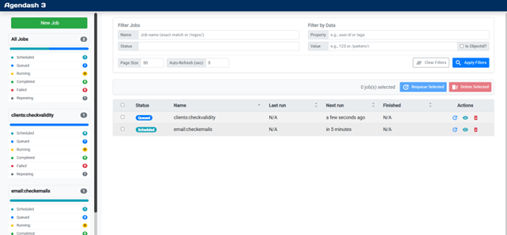
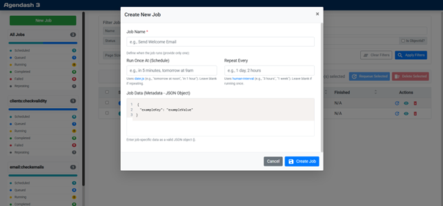
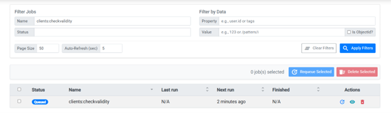
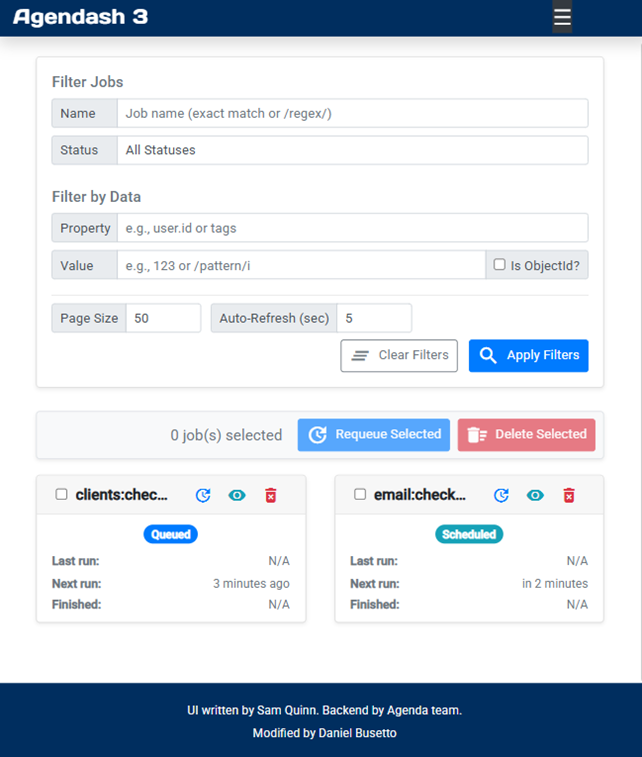
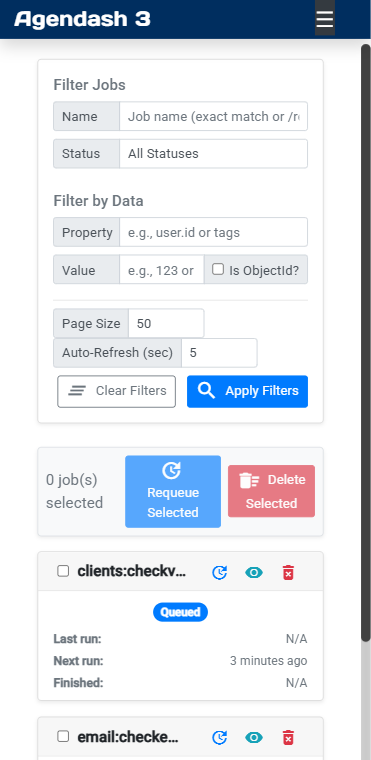

# Agendash Enhanced Dashboard

A dashboard for [Agenda](https://github.com/agenda/agenda) jobs, based on the original
[Agendash](https://github.com/sealos/agendash). It adds pagination, search, execution logs and a
modern, responsive UI. It is an Express middleware you mount in your own application.



## Features

- Job overview by name and state (scheduled, queued, running, completed, failed, repeating), with
  auto-refresh.
- Search by job name and by any property of the job document (ObjectId, number, string or
  `/regex/`), with pagination.
- Job details, including the job data as JSON.
- **Execution logs**: every `start`, `complete` and `fail` event is recorded and shown in the job
  details.
- Create, requeue and delete jobs, one at a time or in bulk.
- Responsive UI for desktop and mobile.

## Requirements

- Node.js 20.19 or newer
- MongoDB (tested with 6.0, 7.0 and 8.2)
- [`@sealos/agenda`](https://www.npmjs.com/package/@sealos/agenda) 1.2
- Express 4.19+ or 5

## Install

```bash
npm install agendash3-rework
```

`@sealos/agenda`, `express` and `mongodb` are peer dependencies: your application provides them.

## Usage

```ts
import express from 'express';
import { Agenda } from '@sealos/agenda';
import { Agendash } from 'agendash3-rework';

const agenda = new Agenda({ db: { address: 'mongodb://127.0.0.1/agendaDb' } });
const app = express();

const agendash = Agendash(agenda);
app.use('/dash', agendash.middleware);

app.listen(3000); // then open http://localhost:3000/dash/
```

With CommonJS:

```js
const { Agendash } = require('agendash3-rework');
```

The named export works in every module system. The package is CommonJS, so in a native ES
module (`"type": "module"`, `.mjs`) a default import gives the whole exports object, not the
function.

`Agendash()` returns `{ middleware, controller }`. `middleware` is an Express app you can mount on
any path; `/dash` is redirected to `/dash/` so the UI's relative URLs resolve. Call
`await agendash.controller.close()` on shutdown to detach Agendash from Agenda's events and close
its dedicated task-log connection, if it opened one.

### Options

```ts
Agendash(agenda, {
  taskLogs: {
    collection: 'tasklogs', // default
    // Optional: store logs through a dedicated connection instead of Agenda's
    connectionString: 'mongodb://127.0.0.1/agendash-logs',
    connectionOptions: { maxPoolSize: 5 }, // MongoDB driver options, plus `dbName`
  },
});
```

| Option | Default | Description |
| --- | --- | --- |
| `taskLogs` | `{}` | Execution logging. Pass `false` to turn it off. |
| `taskLogs.collection` | `'tasklogs'` | Collection that stores the logs. |
| `taskLogs.connectionString` | Agenda's database | Connection string for a dedicated connection. |
| `taskLogs.connectionOptions` | `{}` | MongoDB driver options for that connection, plus `dbName`. |
| `frameAncestors` | `["'self'"]` | Origins allowed to show the dashboard in an iframe. See [Embedding in an iframe](#embedding-in-an-iframe). |
| `auth` | none | Authentication: `apiKey`, `cookie`, `basic` or `custom`, alone or combined. See [Protecting the dashboard](#protecting-the-dashboard). |
| `readOnly` | `false` | `true`, or `(req) => boolean`, refuses every request that would change jobs. |

### Upgrading from 3.x

The 3.x call with a Mongoose connection string still works and keeps logs on a dedicated
connection:

```ts
Agendash(agenda, 'mongodb://127.0.0.1/agendaDb', { dbName: 'agendaDb' });
// same as
Agendash(agenda, {
  taskLogs: { connectionString: 'mongodb://127.0.0.1/agendaDb', connectionOptions: { dbName: 'agendaDb' } },
});
```

Mongoose is no longer a dependency. Logs are written with the MongoDB driver to the same
`tasklogs` collection with the same document shape, so existing logs remain visible.
Mongoose-only connection options (`autoIndex`, `bufferCommands`, ...) are ignored, and
`user`/`pass` are passed to the driver as credentials. Without a connection string, logs go to
the database Agenda already uses.

### Protecting the dashboard

Without the `auth` option, anyone who can reach the mount path can create, requeue and delete
jobs. Agendash can authenticate requests itself with an API key, a cookie validated by your
application, HTTP Basic, or your own function or middleware, alone or combined, and can be made
read-only:

```ts
Agendash(agenda, {
  auth: { type: 'apiKey', keys: process.env.AGENDASH_API_KEY },
  readOnly: (req) => req.get('x-api-key') !== process.env.AGENDASH_ADMIN_KEY,
});
```

Invalid `auth` options throw, so a missing environment variable never leaves the dashboard open.
See [docs/authentication.md](docs/authentication.md) for every strategy and option.

You can also put your own middleware in front of it:

```ts
app.use(
  '/dash',
  (req, res, next) => (req.user?.isAdmin ? next() : res.sendStatus(401)),
  agendash.middleware,
);
```

If you use a CSRF protection middleware, exclude the Agendash routes from it; with the `auth`
option, Agendash requires the `X-Requested-With` header on state-changing requests itself.

### Embedding in an iframe

Agendash sends a strict Content-Security-Policy. By default its `frame-ancestors` directive only
lets pages of the same origin show the dashboard in an iframe. To embed it in a frontend served
from another origin, list that origin:

```ts
Agendash(agenda, { frameAncestors: ["'self'", 'https://app.example.com'] });
```

Each entry is an origin (`https://app.example.com`, `https://*.example.com`), a scheme
(`https:`) or the keyword `'self'` or `'none'`. Only list origins you trust: any page allowed
to frame the dashboard can trick a signed-in user into clicking its buttons.

The policy replaces any `Content-Security-Policy` the host application set earlier on the same
response (for example with helmet), and browsers ignore `X-Frame-Options` when
`frame-ancestors` is present. A reverse proxy that adds its own framing headers still needs to
allow the frontend's origin for this path.

Sessions inside a cross-site iframe rely on third-party cookies (`SameSite=None; Secure`),
which some browsers block. Serving the dashboard from the same site as the frontend, for
example through a reverse proxy, avoids that limit.

## Task logs

Each log entry is stored as:

```json
{ "taskId": "<job _id>", "taskName": "send email", "status": "started | completed | failed", "message": "...", "timestamp": "...", "data": {} }
```

The UI shows the latest 100 entries of a job. Logs are never deleted automatically; add a
[TTL index](https://www.mongodb.com/docs/manual/core/index-ttl/) on `timestamp` if you want them
to expire.

## Indexes

Agendash creates the indexes it needs for sorting the job list on Agenda's collection and a
`{ taskId: 1, timestamp: -1 }` index on the task-log collection.

## Development

```bash
npm install
npm run dev        # example server with an in-memory MongoDB on http://localhost:3000
                   # AGENDASH_API_KEY=... turns on the API-key login, AGENDASH_READ_ONLY=true the read-only mode
npm run dev:ui     # UI with hot reload on http://localhost:5173, API proxied to port 3000
npm test           # builds the UI, then tests against an in-memory MongoDB
npm run lint
npm run typecheck  # server (tsc) and UI (vue-tsc)
npm run build      # server to dist/, UI bundle to dist/public/
```

Project layout:

```text
src/
  index.ts              public exports
  agendash.ts           Agendash() factory
  options.ts            options and legacy-signature handling
  auth/                 authentication strategies and read-only mode
  controllers/          job queries and actions
  http/                 Express middleware, API routes, Content-Security-Policy
  task-logs.ts          execution log storage
ui/                     dashboard (Vue 3, Vite, Bootstrap 5)
  src/api.ts            HTTP client for the API
  src/components/       sidebar, filters, job list and modals
examples/standalone.ts  development server
test/                   Mocha tests (mongodb-memory-server)
```

Commits follow [Conventional Commits](https://www.conventionalcommits.org/); releases are
published by semantic-release from `master`.

## Screenshots

| Create jobs | Search |
| --- | --- |
|  |  |

| Mobile (small) | Mobile (extra small) |
| --- | --- |
|  |  |
